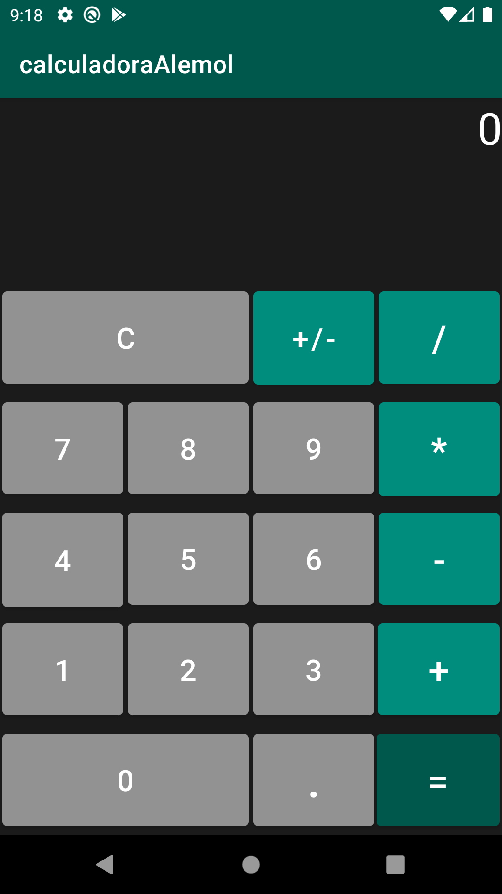

# Calculadora Android de Alemol #
Proyecto de una calculadora con operaciones las operaciones básicas; suma, resta, multiplicación y división.

## DESCRIPCIÓN ## 
La aplicación se encarga de realizar una calculadora con las operaciones básicas. La calculadora realiza las operaciones de manera continua y puedes intercalar operaciones. Las operaciones se ordenan respecto el orden de pulsación, no por la prioridad de las diferentes operaciones.

### Interfaz ###
 
La interfaz costa de dos tipos de botones, los botones de números (en gris) y los botones de operación (en verde).

Los botones de números formarán ordenadamente un número hasta que se pulse una operación.

Los botones de operación se pulsan de tal manera que guarda una variable booleana para controlar su uso, y solo funcionará la última operación seleccionada antes de escribir el siguiente número.

### Demostración de Funcionamiento ###

## Descarga la APK ##
Prueba la aplicación desde [aquí.]()

 